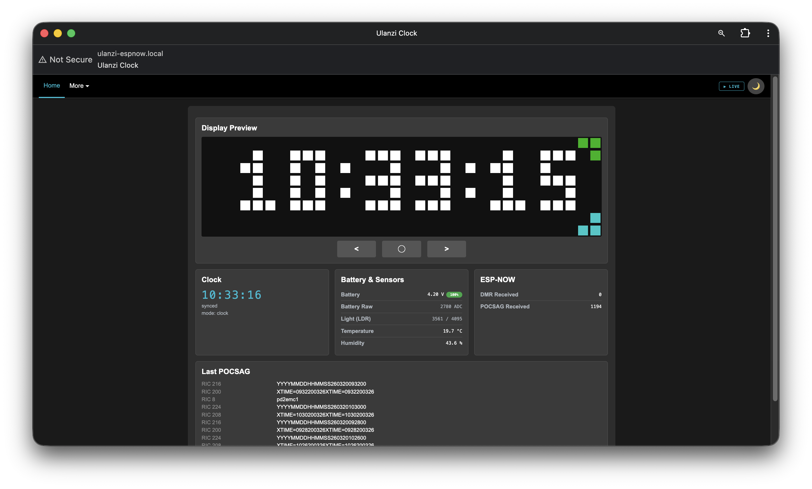
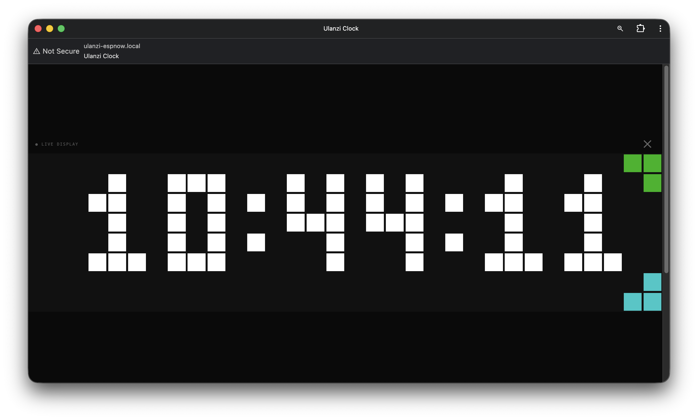
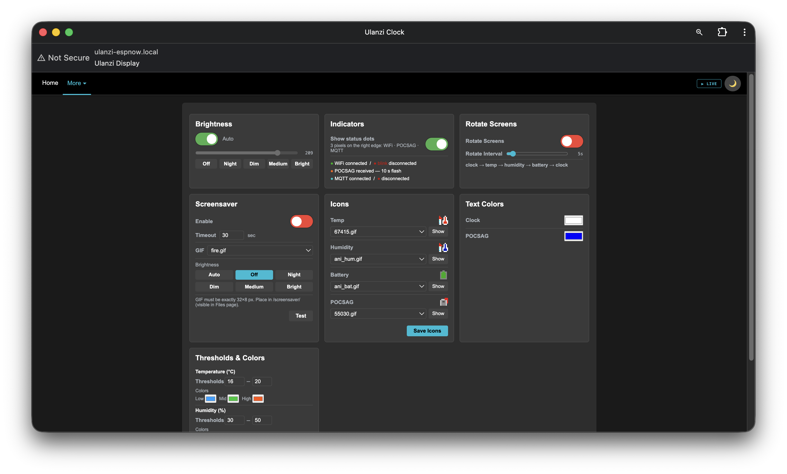
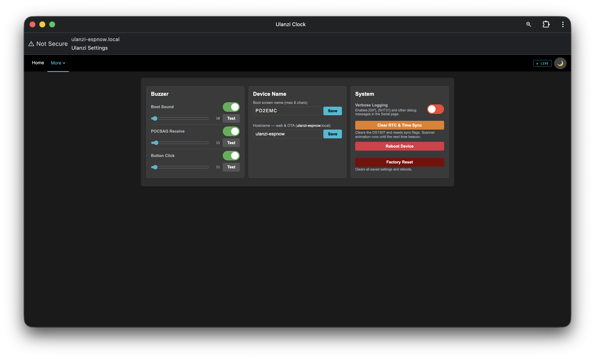
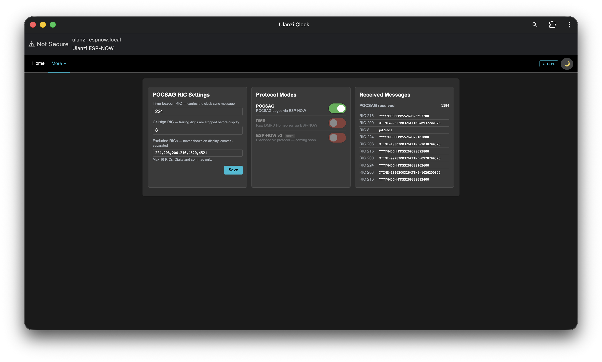
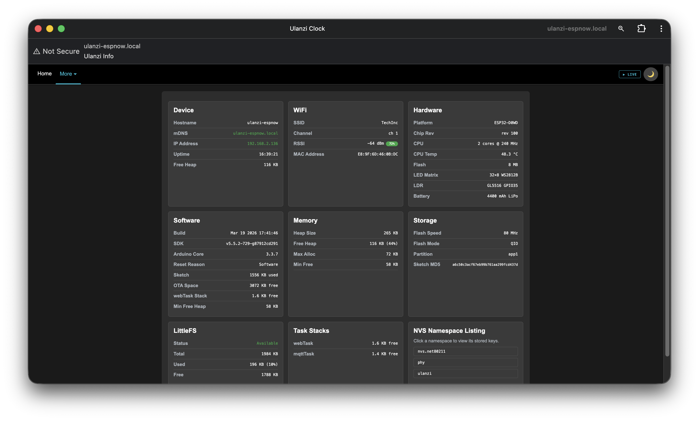
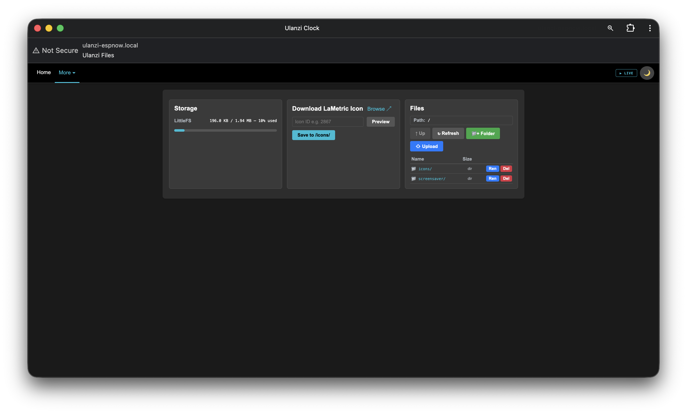
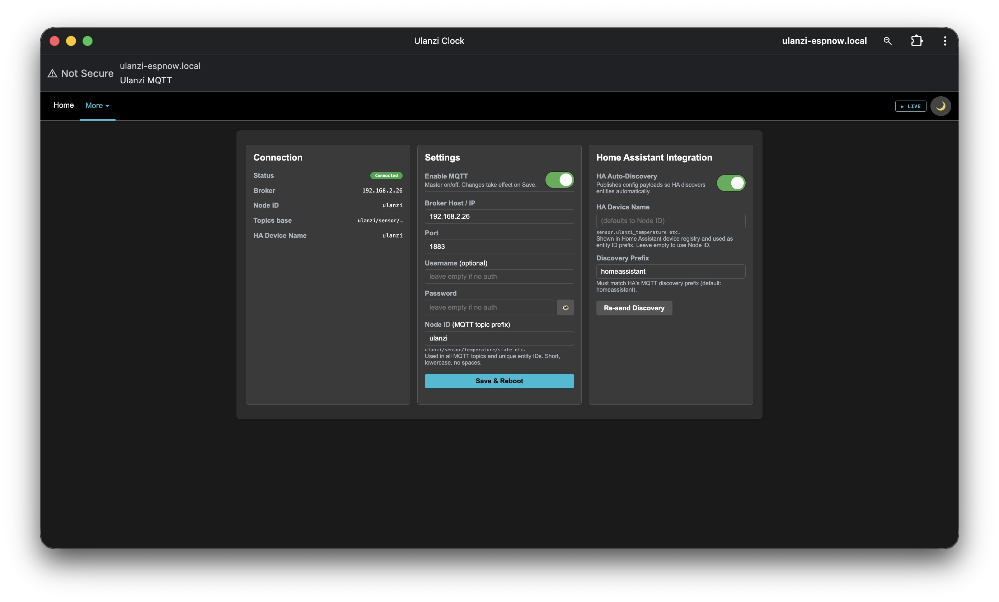
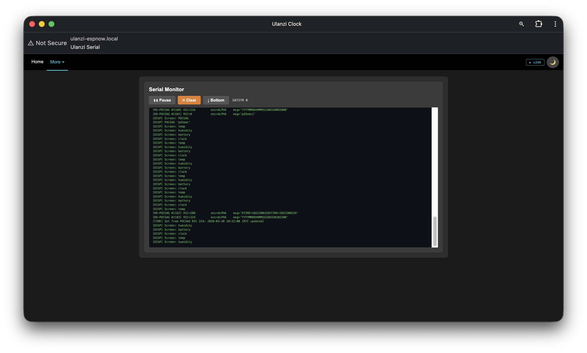

# ulanzi-espnow — ESP-NOW POCSAG/DMR Display for Ulanzi TC001

Receives POCSAG pager messages and DMR radio packets from an MMDVM hotspot over **ESP-NOW**
and displays them on the Ulanzi TC001's 32×8 WS2812B LED matrix.
Shows a live clock between messages, with optional temperature / humidity / battery displays.
Fully configurable from a mobile-friendly web interface — no recompile needed.

---

## Contents

- [How it works](#how-it-works)
- [Hardware — Ulanzi TC001](#hardware--ulanzi-tc001)
- [Firmware Architecture](#firmware-architecture)
  - [Source files](#source-files)
- [Display Modes](#display-modes)
  - [POCSAG message display](#pocsag-message-display)
  - [Temperature / Humidity / Battery](#temperature--humidity--battery)
  - [Clock](#clock)
  - [Screensaver](#screensaver)
  - [Auto-rotate](#auto-rotate)
  - [Boot screen](#boot-screen)
- [Network](#network)
  - [WiFi](#wifi)
  - [mDNS](#mdns)
  - [ArduinoOTA](#arduinoota)
- [POCSAG RIC reference](#pocsag-ric-reference)
- [Web Interface](#web-interface)
  - [Pages](#pages)
- [REST API](#rest-api)
- [Home Assistant](#home-assistant)
- [Icons (LittleFS)](#icons-littlefs)
- [Setup](#setup)
- [Calibration](#calibration)
- [Buttons](#buttons)
- [NVS Settings reference](#nvs-settings-reference)
- [Implementation notes](#implementation-notes)

---

## How it works

The MMDVM hotspot sends raw packets wirelessly over **ESP-NOW** — a connectionless
peer-to-peer 2.4 GHz protocol that works without an access point.
The Ulanzi TC001 receives these packets and renders them on its LED matrix.

- **POCSAG** messages display with a pinned icon and scrolling or static text.
  A special time-beacon RIC (224) lets the hotspot synchronise the display clock.
- **DMR** packets are counted and logged but not rendered on the display.
- Between messages the display cycles through clock, temperature, humidity, and battery.

---

## Hardware — Ulanzi TC001

| Component | Detail |
|---|---|
| MCU | ESP32-WROOM-32D · Xtensa LX6 240 MHz · 8 MB Flash |
| LED Matrix | 32×8 WS2812B · serpentine wiring · GPIO32 |
| Buzzer | Passive piezo · GPIO15 · LEDC PWM |
| LDR | GL5516 ambient light sensor · GPIO35 |
| Buttons | Left GPIO26 · Middle GPIO27 · Right GPIO14 (active LOW, pull-up) |
| Battery | 4400 mAh LiPo · voltage divider on GPIO34 |
| RTC | DS1307 (optional) · I2C · SDA GPIO21 · SCL GPIO22 |
| Temp/Humidity | SHT31 (optional) · I2C address 0x44 · same bus as RTC |

---

## Firmware Architecture

Two FreeRTOS tasks on separate cores keep the display smooth even during web requests:

| Core | Task | Responsibility |
|---|---|---|
| **0** | `webTask` (8 KB stack) | `WebServer.handleClient()` + `ArduinoOTA.handle()` |
| **0** | `mqttTask` (4 KB stack) | MQTT connect / reconnect · state publish · HA discovery |
| **0** | ESP-NOW `onReceive()` | Interrupt-driven — enqueues POCSAG packets via `xQueueSendFromISR` |
| **1** | Arduino `loop()` | Display, buttons, sensors, POCSAG queue drain |

POCSAG packets travel Core 0 → Core 1 through a FreeRTOS queue (`pocsagRxQueue`, depth 4).
All display state is written only from Core 1, eliminating data races without mutexes.

### Source files

| File | Purpose |
|---|---|
| `ulanzi-espnow.ino` | Global variable definitions · `setup()` · `loop()` |
| `config.h` | All compile-time constants and pin assignments |
| `globals.h` | Shared `extern` declarations and packet structs |
| `display.h/.cpp` | Font tables · drawing helpers · brightness · indicators · auto-rotate · screensaver · display loop |
| `receiver.h/.cpp` | ESP-NOW callback · POCSAG processing · WiFi setup |
| `sensor.h/.cpp` | DS1307 RTC (direct I2C) · SHT31 temperature/humidity |
| `buzzer.h/.cpp` | Non-blocking LEDC tone engine |
| `buttons.h/.cpp` | Debounced button handler |
| `nvs_settings.h/.cpp` | NVS Preferences load/save |
| `filesystem.h/.cpp` | LittleFS initialisation |
| `serial_log.h/.cpp` | In-memory ring-buffer for `LOG()` output (served via `/api/serial/log`) |
| `mqtt.h/.cpp` | MQTT client · Home Assistant auto-discovery · state publish |
| `web_server.h/.cpp` | ArduinoOTA + mDNS + WebServer page routes + asset routes |
| `web_handlers_display.h/.cpp` | API handlers: status, brightness, buzzer, icons, colors, screensaver, indicators, buttons |
| `web_handlers_espnow.h/.cpp` | API handlers: ESP-NOW modes, RIC settings |
| `web_handlers_files.h/.cpp` | API handlers: filesystem browser, serial log, file upload/download, LaMetric proxy |
| `web_handlers_mqtt.h/.cpp` | API handlers: MQTT settings and discovery |
| `web_handlers_system.h/.cpp` | API handlers: sysinfo, tasks, device name, NVS, reboot, factory reset, debug |
| `web/styles.h` | Shared CSS + light/dark theme + modal helpers |
| `web/navigation.h` | Shared nav bar + LIVE overlay modal |
| `web/main.h` | Home/dashboard page + `/live` fullscreen page |
| `web/display.h` | Display settings page |
| `web/settings.h` | Device settings page (buzzer, device name, system actions) |
| `web/espnow.h` | ESP-NOW & POCSAG RIC configuration page |
| `web/info.h` | System information page |
| `web/files.h` | File manager page |
| `web/mqtt.h` | MQTT configuration page |
| `web/serial.h` | Serial monitor page |
| `web/pwa_icon.h` | PWA manifest + app icons (served as `/manifest.json`, `/favicon.ico`) |

---

## Display Modes

Priority order (highest wins):

| Priority | Mode | Trigger | Default color |
|---|---|---|---|
| 1 | **OTA progress** | OTA update started | Cyan bar on row 7 |
| 2 | **POCSAG message** | Packet received | Amber |
| 3 | **IP scroll** | WiFi connected at boot | Green |
| 4 | **Icon preview** | Show button in Settings | — |
| 5 | **Screensaver** | Idle timeout | GIF animation |
| 6 | **Clock** | Default | Configurable |
| 6 | **Temperature** | Button / auto-rotate | Dynamic zone color |
| 6 | **Humidity** | Button / auto-rotate | Dynamic zone color |
| 6 | **Battery** | Button / auto-rotate | Dynamic zone color |
| — | **Scanner** | No time sync yet | Blue pulse |

All steady-state colors (clock, POCSAG) and zone threshold colors (temp/hum/bat) are
configurable from the web Settings page and persisted to NVS.

### POCSAG message display

- **Static** (message fits on screen): displayed for `POCSAG_STATIC_MS` (default 15 s) then clock resumes.
  Icon animates at its natural GIF frame rate. Text is centered in the space to the right of the icon.
- **Scrolling** (message too wide): icon pinned at x=0, text scrolls left at `POCSAG_SCROLL_SPEED_MS`
  (default 50 ms/pixel), repeated `POCSAG_SCROLL_PASSES` (default 3) times.
  Text is clipped so it disappears behind the pinned icon rather than overlapping it.
- Buzzer beeps once on receive (configurable per-type: boot / POCSAG / click).
- Auto-rotate pauses while a message is active; rotation timer resets when it clears.

### Temperature / Humidity / Battery

- Each mode draws a configurable icon from LittleFS at x=0, followed by the value centered
  in the remaining space.
- If no icon file is set or the file is missing, the value is centered across the full 32 pixels.
- **Temperature** is displayed as `21.45°` — a custom degree symbol glyph (small circle) is
  rendered from the font table; the `C` suffix is omitted to save space.
- Colors are dynamic: three zones (Low / Mid / High) with independently configurable
  threshold values and colors, set from the Settings page.

### Clock

- Shows HH:MM:SS in a custom 3×5 pixel font, centered on the 32×8 matrix.
- Time source priority:
  1. DS1307 RTC at boot (if fitted and running).
  2. POCSAG time-beacon RIC 224 — the hotspot broadcasts `YYYYMMDDHHMMSS<YYMMDDHHmmSS>` periodically.
     After sync the RTC is updated and `pocsag_synced` is flagged in the API.
- Scanner animation (blue pulse) plays until the first sync arrives.

### Screensaver

- Activates after a configurable idle timeout (seconds).
- Plays a 32×8 GIF stored in `/screensaver/` on LittleFS.
- Any button press, incoming POCSAG message, or OTA event cancels the screensaver.
- File, timeout, and enable/disable are set from the Settings page.

### Auto-rotate

Cycles clock → temperature → humidity → battery → clock on a configurable timer (1–60 s).
Sensor modes are skipped if SHT31 is not detected.
Pauses during POCSAG messages and restores the previous mode when done.

### Boot screen

Displays the device name letter by letter in rainbow colours at startup.
The name (default `ULANZI`, max 8 characters) is configurable from the Settings page
**Device Name** card and persisted to NVS — no recompile needed.
`loadSettings()` runs before `drawBootScreen()` so the saved name is always shown.

---

## Network

### WiFi

The device connects to the configured `WIFI_SSID` at boot. This must be the same network
as the MMDVM hotspot so they share the same 2.4 GHz channel for ESP-NOW.

### mDNS

Once WiFi is connected the device advertises itself via mDNS:

```
http://<mdns-hostname>.local/
```

Default hostname is `ulanzi` → `http://ulanzi.local/`. The hostname is configurable
from the **Device Name** card in Settings (persisted to NVS, takes effect immediately).
The HTTP service is registered so network scanners can discover the device automatically.

### ArduinoOTA

OTA updates are available over WiFi. The OTA hostname (shown in the Arduino IDE
**Port** menu) is the **same as the mDNS hostname** — both use `mdnsName` from NVS.
Change it from the **Device Name** card in Settings and reboot to apply.

```
Host:     ulanzi  (or device IP — matches mDNS hostname)
Port:     3232
Password: set OTA_PASSWORD in config.h (leave empty to disable)
```

During OTA: the matrix shows `UPDATE` + a cyan progress bar on row 7.
On success: `DONE` (green). On error: `ERR` (red) then returns to normal.
OTA runs in `webTask` on Core 0 — the display loop continues uninterrupted.

---

## POCSAG RIC reference

| RIC | Role |
|---|---|
| 224 | **Time beacon** — `YYYYMMDDHHMMSS<YYMMDDHHmmSS>` · sets system clock and DS1307 RTC |
| 8 | **Callsign** — transmitter ID; trailing digits are stripped before display |
| 208 · 200 · 216 · 4520 · 4521 | **Excluded** — logged but never shown on the matrix |
| *any other* | **Displayed** — static or scrolling depending on length |

Excluded RICs, time beacon RIC, and callsign RIC are all set in `config.h`.

---

## Web Interface

Connect to `http://<device-ip>/` or `http://<mdns-hostname>.local/` in any browser (port 80).
Light and dark themes are available (preference stored in `localStorage`).

### Pages

Navigation bar is present on every page. The **More** dropdown links to Display, Settings,
MQTT, ESP-NOW, Files, Info, and Serial. The **LIVE** button opens a fullscreen LED overlay
on any page. Light and dark themes are available (stored in `localStorage`).

#### `/` — Dashboard



| Section | Contents |
|---|---|
| Display preview | 32×8 canvas mirror of the LED matrix · refreshes every 500 ms · Left / Middle / Right button controls |
| Clock | Current time · sync source (waiting / RTC / POCSAG-synced) |
| Battery & Sensors | Battery voltage + % · raw ADC · LDR light level · SHT31 temp + humidity (if fitted) |
| ESP-NOW | DMR packet count · POCSAG packet count |
| Last POCSAG | Recent messages table — RIC + text (newest first) |

#### `/live` — Fullscreen Live Display



32×8 matrix rendered at 20×20 px per LED, refreshes every 250 ms.
Accessible from the **LIVE** button in the navigation bar or as a standalone URL.

#### `/display` — Display Settings



| Card | Controls |
|---|---|
| **Brightness** | Auto (LDR) / manual toggle · slider 1–255 · presets: Off / Night / Dim / Medium / Bright |
| **Indicators** | Toggle status dots on the right edge (WiFi · POCSAG · MQTT) with color legend |
| **Rotate Screens** | Enable auto-cycle · interval slider 1–60 s · sequence: clock → temp → humidity → battery |
| **Screensaver** | Enable · timeout (5–3600 s) · GIF file selector from `/screensaver/` · brightness preset · Test / Stop button |
| **Icons** | File picker for Temp / Humidity / Battery / POCSAG icons · inline preview · Show on matrix button |
| **Text Colors** | Color pickers for Clock text and POCSAG message text |
| **Thresholds & Colors** | Temperature: 2 thresholds (°C) + 3 zone colors · Humidity: same (%) · Battery: same (%) |

All display settings are saved to NVS immediately on change.

#### `/settings` — Device Settings



| Card | Controls |
|---|---|
| **Buzzer** | Enable + volume slider (1–255) + Test button for Boot Sound, POCSAG Receive, and Button Click independently |
| **Device Name** | Boot screen name (1–8 chars, uppercase) · mDNS hostname (→ `<name>.local`) |
| **System** | Verbose logging toggle · Clear RTC & Time Sync · Reboot · Factory Reset |

#### `/espnow` — ESP-NOW Configuration



| Card | Controls |
|---|---|
| **POCSAG RIC Settings** | Time beacon RIC (default 224) · Callsign RIC (default 8) · Excluded RICs (comma-separated, up to 16) |
| **Protocol Modes** | POCSAG toggle · DMR (future) · ESP-NOW v2 (future) |
| **Received Messages** | POCSAG packet count · recent message log with RIC and text |

#### `/info` — System Information



| Card | Contents |
|---|---|
| **Device** | Hostname · IP · uptime (d HH:MM:SS) · free heap |
| **WiFi** | SSID · channel · RSSI with signal badge · MAC address |
| **Hardware** | Chip model/revision · CPU cores/MHz · CPU temperature · flash size · LED / LDR / battery specs |
| **Software** | Build date/time · SDK version · Arduino core version · reset reason · sketch size · OTA space |
| **Memory** | Heap total/free/% · max allocation · min free · PSRAM (if present) |
| **Storage** | Flash speed/mode · partition · sketch MD5 · LittleFS total/used/available |
| **Task Stacks** | webTask and mqttTask free stack with color warnings |
| **NVS** | All namespaces listed as buttons · click to inspect keys, types, and values in a modal |

#### `/files` — File Manager



LittleFS usage bar (color changes at 60 % and 85 %) ·
LaMetric icon downloader (enter icon ID → HTTPS proxy → preview → save to `/icons/`) ·
Full file browser: navigate directories, upload files, create folders, rename, delete, download.
Click any `.gif` or `.jpg` to preview inline.

#### `/mqtt` — MQTT / Home Assistant



| Card | Controls |
|---|---|
| **Connection** | Status badge (Connected / Disconnected / Disabled) · broker · node ID · topics preview · HA device name |
| **Settings** | Enable toggle · broker host · port · username · password · node ID · Save button |
| **Home Assistant** | Auto-discovery toggle · HA device name · discovery prefix · Re-send Discovery button |

#### `/serial` — Serial Monitor



Live `LOG()` output streamed from the device ring buffer (polls every second).
Pause / Resume · Clear buffer · auto-scroll to bottom.

---

## REST API

All endpoints respond with JSON unless noted. POST bodies use
`application/x-www-form-urlencoded` unless stated otherwise.
Settings POSTs write to NVS immediately.

### Status & display

| Method | Endpoint | Description |
|---|---|---|
| GET | `/api/status` | Full JSON — hostname, role, IP, channel, uptime, time-sync flags, time, DMR/POCSAG counts, POCSAG log, brightness, LDR, battery, MAC, SSID, RSSI, free heap, buzzer settings, SHT31, display mode, rotate settings |
| GET | `/api/leds` | 256-pixel RRGGBB hex string (`RRGGBBRRGGBB…`) for live canvas rendering |

### Brightness

| Method | Endpoint | Body params | Description |
|---|---|---|---|
| POST | `/api/brightness` | `auto=0/1` · `level=0-255` | Set auto or manual brightness |

### Buzzer

| Method | Endpoint | Body params | Description |
|---|---|---|---|
| POST | `/api/buzzer` | `boot_en=0/1` · `boot_vol=0-255` · `pocsag_en=0/1` · `pocsag_vol=0-255` · `click_en=0/1` · `click_vol=0-255` | Save buzzer settings |
| POST | `/api/buzzer/test` | `type=boot/pocsag/click` · `vol=1-255` | Play a test tone immediately |

### Display rotation

| Method | Endpoint | Body params | Description |
|---|---|---|---|
| POST | `/api/rotate` | `enabled=0/1` · `interval=1-60` | Auto-rotate on/off and interval (seconds) |

### Icons

| Method | Endpoint | Params | Description |
|---|---|---|---|
| GET | `/api/icons` | — | Current icon paths for temp / hum / bat / POCSAG |
| POST | `/api/icons` | `temp_icon` · `hum_icon` · `bat_icon` · `poc_icon` | Save icon file paths |
| POST | `/api/icons/preview` | `path=/icons/file.gif` | Show icon on matrix for 5 s |
| GET | `/api/icons/proxy?id=NNNNN` | `id` (query) | Proxy LaMetric icon over HTTPS (browser canvas converts PNG→JPEG) |

### Display colors

| Method | Endpoint | Body params | Description |
|---|---|---|---|
| GET | `/api/colors` | — | All current color and threshold values |
| POST | `/api/colors` | See table below | Update any combination of colors / thresholds |

POST `/api/colors` accepts any subset of:

| Param | Format | Meaning |
|---|---|---|
| `clock` | `#RRGGBB` | Clock text color |
| `poc` | `#RRGGBB` | POCSAG message text color |
| `tmp_thr_lo` · `tmp_thr_hi` | float (°C) | Temperature zone thresholds |
| `t_lo` · `t_mid` · `t_hi` | `#RRGGBB` | Temperature zone colors (below lo / between / above hi) |
| `hum_thr_lo` · `hum_thr_hi` | float (%) | Humidity zone thresholds |
| `h_lo` · `h_mid` · `h_hi` | `#RRGGBB` | Humidity zone colors |
| `bat_thr_lo` · `bat_thr_hi` | integer 0-100 (%) | Battery zone thresholds |
| `b_lo` · `b_mid` · `b_hi` | `#RRGGBB` | Battery zone colors |

### Screensaver

| Method | Endpoint | Body params | Description |
|---|---|---|---|
| GET | `/api/screensaver` | — | Current screensaver settings (`enabled`, `timeout`, `file`, `active`, `brightness`) |
| POST | `/api/screensaver` | `enabled=0/1` · `timeout=1-3600` · `file=/screensaver/x.gif` · `brightness=-2 to 255` | Save screensaver settings (`brightness`: -2=off, -1=dim, 0-255=fixed) |
| POST | `/api/screensaver/test` | `action=test/stop` | Start or stop screensaver immediately |

### Indicators

| Method | Endpoint | Body params | Description |
|---|---|---|---|
| GET | `/api/indicators` | — | Current indicator state (`enabled`) |
| POST | `/api/indicators` | `enabled=0/1` | Toggle status dots on the right edge of the matrix |

### Virtual buttons

| Method | Endpoint | Description |
|---|---|---|
| POST | `/api/btn/left` | Trigger left button action (plays click sound) |
| POST | `/api/btn/middle` | Trigger middle button action (toggle auto-brightness) |
| POST | `/api/btn/right` | Trigger right button action (cycle display mode) |

### Device identity

| Method | Endpoint | Body params | Description |
|---|---|---|---|
| GET | `/api/bootname` | — | Current boot screen name |
| POST | `/api/bootname` | `name=MYNAME` | Set boot screen name (1–8 chars, auto-uppercased) |
| GET | `/api/mdnsname` | — | Current mDNS/OTA hostname |
| POST | `/api/mdnsname` | `name=mydevice` | Set mDNS/OTA hostname (1–31 chars, a-z 0-9 -) · reboot to apply |

### ESP-NOW / POCSAG RICs

| Method | Endpoint | Body params | Description |
|---|---|---|---|
| GET | `/api/espnow/modes` | — | Enabled protocol flags (`pocsag`, `dmr`, `espnow2`) |
| POST | `/api/espnow/modes` | `pocsag=0/1` | Toggle POCSAG receive mode |
| GET | `/api/espnow` | — | RIC settings (`time_ric`, `call_ric`, `excl_rics` array) |
| POST | `/api/espnow` | `time_ric` · `call_ric` · `excl_rics` (comma-separated) | Save RIC settings |

### MQTT

| Method | Endpoint | Body params | Description |
|---|---|---|---|
| GET | `/api/mqtt` | — | All MQTT settings + connection status |
| POST | `/api/mqtt` | `enabled=0/1` · `broker=host` · `port=1883` · `user=` · `pass=` · `node=node-id` · `prefix=homeassistant` · `ha_name=` · `discovery=0/1` | Save MQTT settings and reconnect |
| POST | `/api/mqtt/discovery` | — | Re-send Home Assistant auto-discovery payloads |

### Filesystem

| Method | Endpoint | Body / Query params | Description |
|---|---|---|---|
| GET | `/api/fs` | — | LittleFS total / used / available bytes |
| GET | `/api/fs/ls?path=/dir` | `path` (query) | List one directory (name, path, isDir, size) |
| GET | `/api/fs/download?path=/file` | `path` (query) | Download file as attachment |
| POST | `/api/fs/delete` | `path=/file` | Delete file or empty directory |
| POST | `/api/fs/mkdir` | `path=/newdir` | Create directory |
| POST | `/api/fs/rename` | `from=/old` · `to=/new` | Rename / move file or directory |
| GET | `/api/files` | — | Recursive flat listing of all files (`name`, `size`) |
| POST | `/api/files/upload?dir=/icons` | multipart form data | Upload file to specified directory |
| POST | `/api/files/delete` | `name=/file` | Delete file (legacy — prefer `/api/fs/delete`) |

### Serial log

| Method | Endpoint | Params | Description |
|---|---|---|---|
| GET | `/api/serial/log?cursor=N` | `cursor` (query, default 0) | Fetch new log lines since cursor; returns `{data, cursor}` |
| POST | `/api/serial/clear` | — | Clear the in-memory serial log buffer |

### Debug logging

| Method | Endpoint | Body | Description |
|---|---|---|---|
| GET | `/api/debug` | — | Returns `{"debug": true/false}` |
| POST | `/api/debug` | raw body: `true` or `false` (JSON, `Content-Type: application/json`) | Enable or disable verbose logging (`[GIF]`, `[SHT31]`, etc.) |

### System

| Method | Endpoint | Description |
|---|---|---|
| GET | `/api/sysinfo` | Chip model, revision, cores, CPU MHz, temp, heap, PSRAM, flash, sketch, MD5, partition, reset reason, SDK, Arduino version, mDNS status, build timestamp, webTask stack |
| GET | `/api/tasks` | webTask and mqttTask free stack watermarks (bytes) |
| GET | `/api/nvs/namespaces` | List all NVS namespaces |
| GET | `/api/nvs/keys?ns=NAME` | List keys, types, and values in a namespace (sensitive values masked) |
| POST | `/api/rtc/clear` | Stop DS1307 oscillator · reset time-sync flags · show scanner immediately (no reboot) |
| POST | `/api/reboot` | Reboot immediately |
| POST | `/api/factory-reset` | Clear all NVS settings and reboot |

---

## Home Assistant

When MQTT is enabled with auto-discovery, the device registers itself as a device in Home
Assistant and creates the following entities automatically.

### Sensors (read-only)

| Entity ID | Name | Unit | Notes |
|---|---|---|---|
| `sensor.<ha_name>_temperature` | Temperature | °C | SHT31 only — not created if sensor absent |
| `sensor.<ha_name>_humidity` | Humidity | % | SHT31 only |
| `sensor.<ha_name>_battery_pct` | Battery | % | Calculated from raw ADC |
| `sensor.<ha_name>_battery_mv` | Battery Voltage | mV | |
| `sensor.<ha_name>_rssi` | WiFi RSSI | dBm | |
| `sensor.<ha_name>_uptime` | Uptime | s | |
| `sensor.<ha_name>_ldr_raw` | LDR Raw | — | Raw ADC (0–4095) |
| `sensor.<ha_name>_pocsag_msg` | POCSAG Message | — | Last received message text |
| `sensor.<ha_name>_pocsag_count` | POCSAG Count | — | Total packets received |
| `sensor.<ha_name>_dmr_count` | DMR Count | — | Total packets received (RECV_DMR only) |
| `sensor.<ha_name>_display_mode` | Display Mode | — | Active screen name (`clock`, `temp`, etc.) |

### Switches (read + command)

| Entity ID | Name | Controls |
|---|---|---|
| `switch.<ha_name>_auto_brightness` | Brightness Auto | Auto-brightness on/off |
| `switch.<ha_name>_buzzer_boot` | Buzzer Boot Sound | Enable/disable |
| `switch.<ha_name>_buzzer_pocsag` | Buzzer POCSAG | Enable/disable |
| `switch.<ha_name>_buzzer_click` | Buzzer Button Click | Enable/disable |
| `switch.<ha_name>_auto_rotate` | Rotate Screens | Enable/disable |
| `switch.<ha_name>_screensaver` | Screensaver | Enable/disable |
| `switch.<ha_name>_indicators` | Indicators | Enable/disable status dots |
| `switch.<ha_name>_debug_log` | Debug Log | Enable/disable verbose logging |

### Selects (read + command)

| Entity ID | Name | Options |
|---|---|---|
| `select.<ha_name>_brightness_preset` | Brightness Preset | Off · Night · Dim · Medium · Bright · Custom |
| `select.<ha_name>_screensaver_brightness` | Screensaver Brightness | Auto · Off · Night · Dim · Medium · Bright |
| `select.<ha_name>_screensaver_file` | Screensaver File | Files from `/screensaver/` on LittleFS + None |

### Numbers (read + command)

| Entity ID | Name | Range |
|---|---|---|
| `number.<ha_name>_brightness` | Brightness | 1–255 |
| `number.<ha_name>_buzzer_boot_vol` | Buzzer Boot Volume | 1–255 |
| `number.<ha_name>_buzzer_pocsag_vol` | Buzzer POCSAG Volume | 1–255 |
| `number.<ha_name>_buzzer_click_vol` | Buzzer Click Volume | 1–255 |
| `number.<ha_name>_auto_rotate_interval` | Rotate Interval | 1–60 s |
| `number.<ha_name>_screensaver_timeout` | Screensaver Timeout | 10–3600 s |

### Buttons (trigger only)

| Entity ID | Name | Action |
|---|---|---|
| `button.<ha_name>_btn_left` | Button Left | Plays click sound |
| `button.<ha_name>_btn_middle` | Button Middle | Toggle auto-brightness |
| `button.<ha_name>_btn_right` | Button Right | Cycle display mode |
| `button.<ha_name>_reboot` | Reboot | Reboot device immediately |
| `button.<ha_name>_clear_rtc` | Clear RTC | Stop DS1307 · reset time-sync · show scanner |

> `<ha_name>` defaults to `ulanzi` (configurable from the MQTT page **HA Device Name** field).

---

## Icons (LittleFS)

Icons are stored on the ESP32's LittleFS filesystem. Upload them via the **Files** page
or with `arduino-cli` / `esptool`.

| Directory | Contents |
|---|---|
| `/icons/` | GIF or JPEG icons for Temp / Humidity / Battery / POCSAG |
| `/screensaver/` | GIF files exactly **32×8 pixels** for the screensaver |

**Supported formats:** GIF (animated or static) and JPEG.
Icons should be 8×8 pixels for best results. The display centers them vertically.

**GIF looping:** both GIFs with the Netscape infinite-loop extension and plain
single-play GIFs loop continuously — when `playFrame` returns 0 (last frame) the
file handle is closed and reopened on the next tick, restarting from frame 0.

**LaMetric icons:** the Files page has a built-in downloader. Enter a LaMetric icon ID,
preview the image, and save it directly to `/icons/` — no PC needed.

---

## Setup

### 1. Sender (MMDVM hotspot)

Flash the hotspot firmware with ESP-NOW sender enabled.
Get the Ulanzi's MAC address from the serial monitor at first boot:

```
[INFO] My MAC: AA:BB:CC:DD:EE:FF
```

Paste it into the hotspot's sender config as `RECEIVER_MAC`.

### 2. Ulanzi — edit `config.h`

```cpp
// Enable the protocols your hotspot sends
#define RECV_POCSAG  true
#define RECV_DMR     false

// Same WiFi network as the hotspot (ensures matching ESP-NOW channel)
#define WIFI_SSID      "YourSSID"
#define WIFI_PASSWORD  "YourPassword"

// OTA password (leave empty to disable password protection)
#define OTA_PASSWORD  "ulanzi"

// Time beacon RIC (must match hotspot)
#define TIME_POCSAG_RIC  224

// Callsign RIC (trailing digits stripped before display)
#define CALLSIGN_RIC  8

// RICs that are never shown on the LED matrix
#define POCSAG_DISPLAY_EXCLUDED_RICS  { 224, 208, 200, 216, 4520, 4521 }
```

> **Note:** the boot screen name and mDNS/OTA hostname are set at runtime from the
> **Device Name** card in Settings — no recompile needed. A reboot is required for the
> new hostname to take effect.

### 3. Required Arduino libraries

Install via **Sketch → Include Library → Manage Libraries**:

| Library | Author | Purpose |
|---|---|---|
| ESP32 Arduino core ≥ 3.x | Espressif | Board support (install via Board Manager) |
| FastLED | Daniel Garcia | WS2812B LED matrix |
| AnimatedGIF | Larry Bank | Animated GIF playback |
| TJpg_Decoder | Bodmer | JPEG decode and render |
| SHT31 | Rob Tillaart | Temperature/humidity sensor |

### 4. Flash

Select board **ESP32 Dev Module** (or equivalent), 921600 baud, then Upload.
After first boot, subsequent updates can be done via OTA.

---

## Calibration

### LDR auto-brightness

Watch `ldr_raw` in the dashboard while adjusting room lighting:

```cpp
#define LDR_ADC_DARK    1600   // ADC when sensor is fully covered (darkest condition)
#define LDR_ADC_BRIGHT  4000   // ADC in your brightest normal lighting
#define LDR_MIN_BRIGHTNESS  5  // minimum brightness in auto mode (0–255)
```

Brightness is EMA-smoothed (¼ weight per 2 s sample) to prevent flickering.
Re-enabling auto mode snaps immediately to the current LDR reading.

### Battery ADC

The TC001 uses a large voltage divider — raw ADC range is 510–660, not a simple 1:2 ratio.

```cpp
#define BAT_RAW_EMPTY  510   // ADC reading at fully depleted (~3.0 V)
#define BAT_RAW_FULL   660   // ADC reading at fully charged (~4.2 V)
```

Watch `battery_raw` in `/api/status` at full and empty charge to recalibrate.

---

## Buttons

| Button | Action |
|---|---|
| **Left** (GPIO26) | Reserved — plays click sound |
| **Middle** (GPIO27) | Toggle auto-brightness on/off |
| **Right** (GPIO14) | Cycle display mode: clock → temp → humidity → battery → clock |

- Mode change via button times out back to clock after 10 s (auto-rotate manages its own timer).
- All buttons are debounced at 50 ms.
- Any button press exits the screensaver and resets the idle countdown.

---

## NVS Settings reference

All settings are stored in NVS namespace `ulanzi`. Defaults apply on first boot or after
flashing new firmware that adds a new key.

| Key | Type | Default | Setting |
|---|---|---|---|
| `auto_br` | u8 | 1 | Auto-brightness enabled |
| `brightness` | u8 | 50 | Manual brightness level (0–255) |
| `buz_boot_en` / `buz_boot_vol` | u8 / u8 | 1 / 80 | Boot chime enable / volume |
| `buz_poc_en` / `buz_poc_vol` | u8 / u8 | 1 / 80 | POCSAG beep enable / volume |
| `buz_clk_en` / `buz_clk_vol` | u8 / u8 | 1 / 60 | Button click enable / volume |
| `rot_en` / `rot_sec` | u8 / u8 | 0 / 5 | Auto-rotate enable / interval (s) |
| `icon_temp` / `icon_hum` / `icon_bat` / `icon_poc` | string | `""` | Icon file paths (LittleFS) |
| `scr_en` / `scr_timeout` / `scr_file` | u8 / u16 / string | 0 / 60 / `""` | Screensaver enable / timeout / GIF file |
| `scr_bright` | i32 | 50 | Screensaver brightness (-2=Auto, -1=Off, 0/10/50/120/255=presets) |
| `clk_col` | u32 (RGB) | 16777215 (white) | Clock text color |
| `poc_col` | u32 (RGB) | 255 (blue) | POCSAG message text color |
| `tmp_thr_lo` / `tmp_thr_hi` | blob (float) | 16.0 / 20.0 | Temperature thresholds (°C) |
| `tmp_col_lo` / `tmp_col_mid` / `tmp_col_hi` | u32 (RGB) | blue / green / orange | Temperature zone colors |
| `hum_thr_lo` / `hum_thr_hi` | blob (float) | 30.0 / 50.0 | Humidity thresholds (%) |
| `hum_col_lo` / `hum_col_mid` / `hum_col_hi` | u32 (RGB) | orange / green / blue | Humidity zone colors |
| `bat_thr_lo` / `bat_thr_hi` | u8 / u8 | 30 / 60 | Battery thresholds (%) |
| `bat_col_lo` / `bat_col_mid` / `bat_col_hi` | u32 (RGB) | red / yellow / green | Battery zone colors |
| `debug_log` | u8 | 0 | Verbose logging (`[GIF]`, `[SHT31]`, etc.) |
| `ind_en` | u8 | 1 | Status dot indicators enabled |
| `recv_pocsag` | u8 | 1 | POCSAG receive mode enabled |
| `ric_time` | u32 | 224 | Time-beacon RIC |
| `ric_call` | u32 | 8 | Callsign RIC |
| `ric_excl` | string | `"224,208,200,216,4520,4521"` | Excluded RICs (comma-separated) |
| `mqtt_en` | u8 | 0 | MQTT enabled |
| `mqtt_broker` | string | `""` | MQTT broker hostname or IP |
| `mqtt_port` | u16 | 1883 | MQTT broker port |
| `mqtt_user` / `mqtt_pass` | string / string | `""` / `""` | MQTT credentials |
| `mqtt_node` | string | `"ulanzi"` | MQTT node ID (topic prefix) |
| `mqtt_prefix` | string | `"homeassistant"` | HA discovery prefix |
| `mqtt_ha_name` | string | `""` | Home Assistant device name |
| `mqtt_disc` | u8 | 0 | HA auto-discovery enabled |
| `boot_name` | string | `"ULANZI"` | Boot screen device name (max 8 chars, uppercase) |
| `mdns_name` | string | `"ulanzi"` | mDNS + OTA hostname → `<name>.local` |

---

## Implementation notes

- **`WiFi.setSleep(false)`** is required — WiFi power-save CPU pauses interrupt the RMT
  peripheral used by WS2812B, causing color glitches on every `FastLED.show()`.
- **`webTask` stack ≥ 8 KB** — `/api/status` allocates `char json[2500]` + `char logBuf[1100]`
  on the stack (~3.7 KB locals). Do not reduce below 6 KB.
- **`loadSettings()` before `drawBootScreen()`** — NVS (Preferences) is independent of
  LittleFS and can be read before the filesystem is mounted. Moving the call earlier ensures
  the saved boot name, brightness, and all other settings are applied before anything is
  displayed.
- **AnimatedGIF looping** — `playFrame` returns 1 while frames remain, 0 on the last frame
  of a non-looping GIF, and negative on a decode error. GIFs with the Netscape infinite-loop
  extension auto-rewind internally (never return 0). To make all GIFs loop regardless of
  their metadata, the code closes the file handle on `result == 0` so the next call to
  `_gifEnsureOpen` reopens from frame 0. `result < 0` returns `ICON_DRAW_FAILED` to trigger
  the bitmap fallback.
- **AnimatedGIF `_gif.begin()`** must be called before every `_gif.open()` — `_gif.close()`
  resets internal pixel byte order state.
- **TJpg_Decoder**: use the `getFsJpgSize(&w, &h, path, LittleFS)` overload — the
  `getFsJpgSize(File)` overload takes `fs::File` by value, whose destructor closes the
  shared file handle before `drawFsJpg` can use it.
- **I2C (DS1307 + SHT31)**: both devices share Wire and are accessed only from Core 1, so no
  mutex is needed.
- **POCSAG display state** is written only from Core 1 via `processPocsagPacket()` called
  in `loop()`. The ESP-NOW callback on Core 0 uses `xQueueSendFromISR` to avoid data races.
- **mDNS + OTA hostname** share a single `mdnsName` value from NVS. Both use it at boot:
  `WiFi.setHostname(mdnsName)`, `ArduinoOTA.setHostname(mdnsName)`, `MDNS.begin(mdnsName)`.
  A **reboot is required** after changing the hostname — `MDNS.end()`/`begin()` at runtime
  is unreliable on ESP32 Arduino. The `/api/mdnsname` response includes `"reboot":true`.
